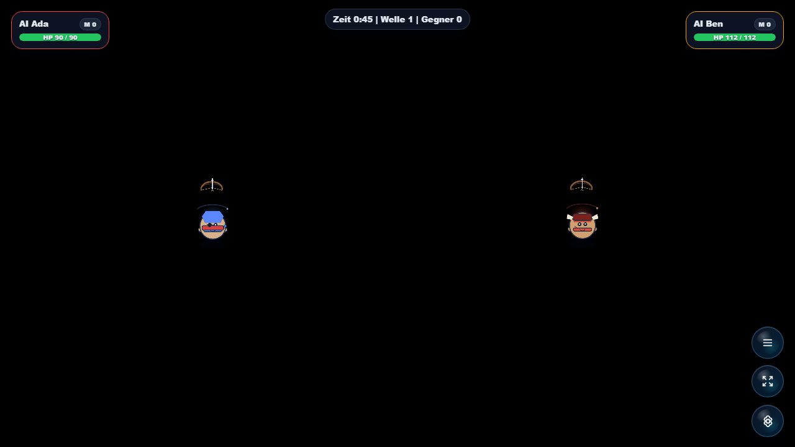

# Arena Survivor

Co-op arena survival game for Open Party Lab with character choices, waves, and difficulty setup.



## Status

Beta. The survival loop, character choice, and lobby setup are already good to play locally. Still needs deeper progression, balancing, and enemy/readability passes before a stable release.

## Visual Themes

The host can select the complete art set during run setup:

- **Obsidian Relay** is the default detailed sci-fi set with its own arena map, character classes, machine enemies, weapons, portraits, and shop modules.
- **Classic Arena** keeps the original warm organic presentation.

The selection is visual only and does not change gameplay balance.

## Run Through Open Party Lab

This repo is not a standalone app. Run it through the Open Party Lab platform.

Recommended layout:

```text
Open-Party-Lab/
  local-games/
    arena-survivor/
```

From the Platform repo:

```bash
npm install
npm run games:sync-local
npm run dev:all
```

The Platform loads this game only when the repo exists locally and `npm run games:sync-local` links it. Missing optional games are skipped.

## GitHub Metadata

Description:

```text
Co-op arena survival game for Open Party Lab with character choices, waves, and difficulty setup.
```

Suggested topics:

```text
open-party-lab party-game browser-game phaser typescript local-multiplayer arena-survival
```

## Package Entrypoints

- `@open-party-lab/game-arena-survivor/manifest`
- `@open-party-lab/game-arena-survivor/protocol`
- `@open-party-lab/game-arena-survivor/server`
- `@open-party-lab/game-arena-survivor/host`
- `@open-party-lab/game-arena-survivor/controller`

The Platform should import only these public entrypoints.

## Development Checks

```bash
npm install
npm run typecheck
npm run build
npm run pack:dry-run
```

For visual checks, start Open Party Lab, add virtual controllers when needed, and capture host screenshots through a browser.

## Spawn Limits

Enemy pressure uses two configurable limits in `src/server/arenaSurvivorConfig.ts`:

- `baseMaxEnemiesOnScreen` is the wave- and difficulty-scaled pacing limit.
- `maxActiveEnemies` is the absolute safety cap and defaults to 100.

Active enemies never exceed the hard cap. Due spawn indicators remain queued until a slot opens. When a regular spawn burst is shortened because the pacing limit has nearly been reached, the remaining slots use the strongest currently unlocked enemy pool instead of adding more low-tier enemies.

## License

Code is licensed under the Apache License 2.0. See [LICENSE](LICENSE).

Assets, generated media, word lists, prompts, and third-party references may need separate rights review before public store distribution.
